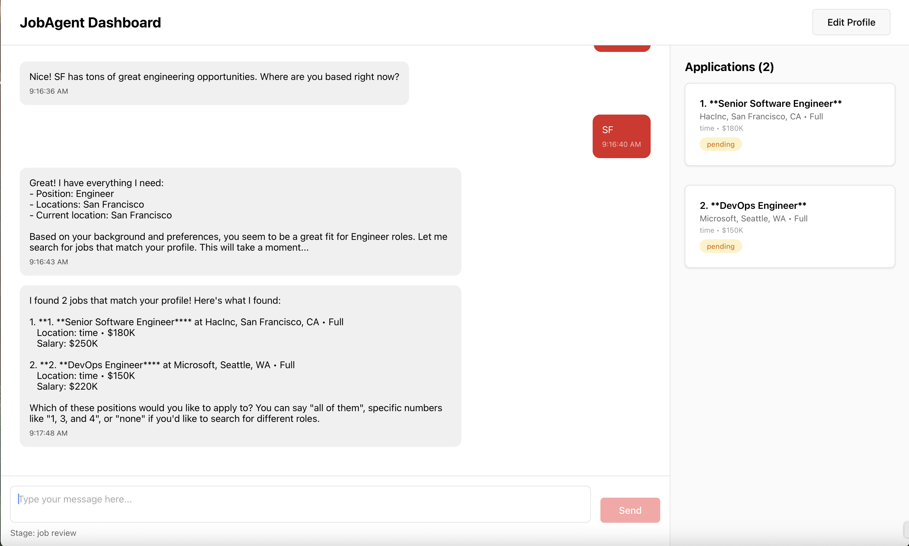
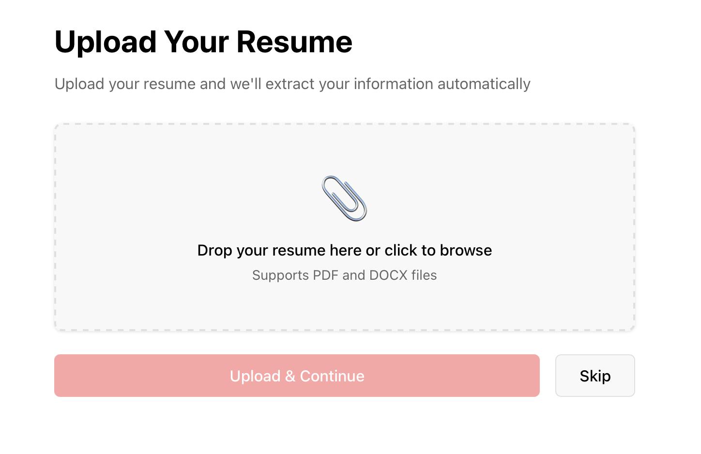
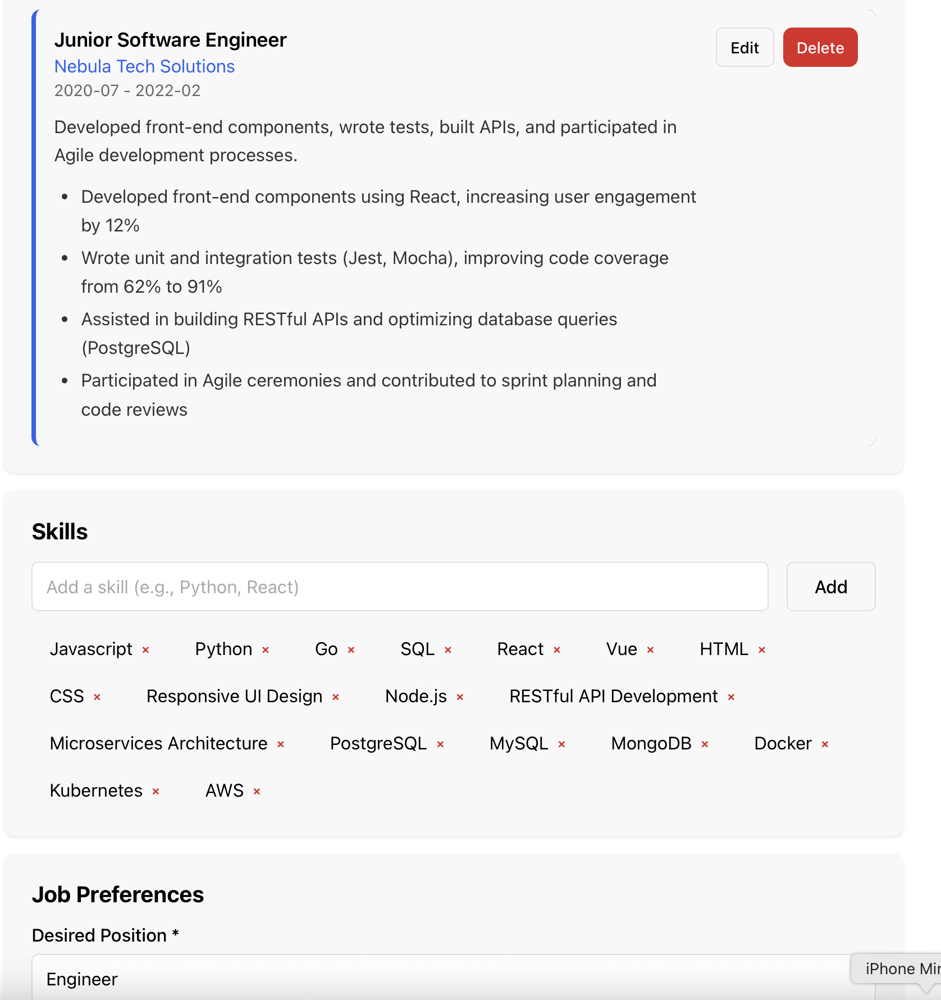
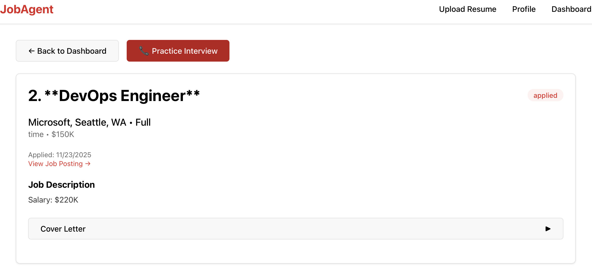
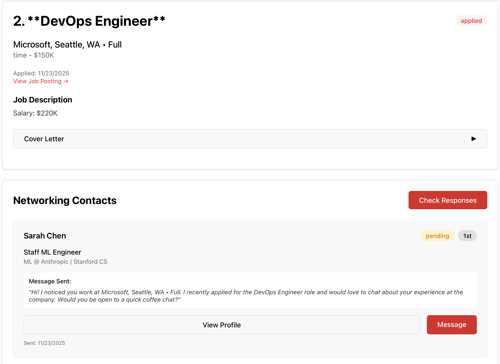
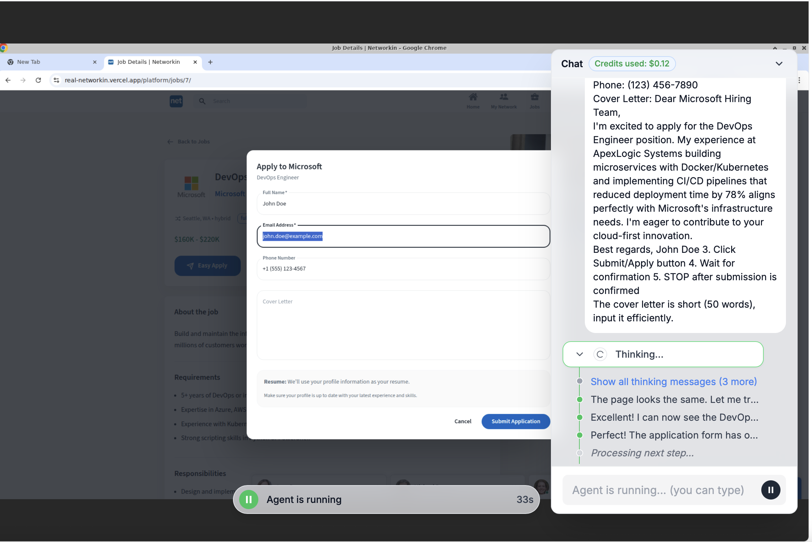

# 🚀 JobAgent - AI-Powered Job Application Assistant

<div align="center">


**Automate your entire job application process with AI-powered browser automation**

[Features](#-features) • [Quick Start](#-quick-start) • [Screenshots](#-screenshots) • [Documentation](#-documentation)

</div>

---

## 📖 Overview

JobAgent is an intelligent job application assistant that revolutionizes the job search process. Simply upload your resume, and our AI agent automatically:

- 🔍 **Searches** for jobs matching your preferences on NetworkIn (LinkedIn clone)
- ✍️ **Generates** tailored cover letters using Claude AI
- 📝 **Applies** to positions automatically with your information
- 🤝 **Networks** by reaching out to employees at target companies
- 📊 **Tracks** all applications and networking responses in one dashboard

Built for a 2-day hackathon, this full-stack application demonstrates the power of AI automation in streamlining tedious job search workflows.

---

## ✨ Features

### 🎯 Core Capabilities

- **📄 Smart Resume Parsing**: Upload PDF/DOCX resumes and automatically extract structured data using Claude API
- **👤 Profile Management**: Comprehensive profile builder with work experience, education, skills, and job preferences
- **🤖 Automated Job Search**: AI agent navigates NetworkIn, searches by position, and extracts job details
- **✉️ Intelligent Cover Letters**: AI-generated, tailored cover letters for each application
- **🚀 One-Click Applications**: Automated form filling and submission
- **🌐 Networking Automation**: Find and reach out to employees at target companies for referrals
- **📈 Response Tracking**: Monitor networking outreach and application statuses in real-time
- **💬 Conversation Agent**: Interactive AI agent that can help with job search via voice or chat
- **📞 AI Interview Prep**: Get a phone call from an AI assistant to practice for your upcoming interview - just provide your phone number and get instant interview practice tailored to the job

### 🎨 User Experience

- **Modern React UI**: Clean, intuitive interface built with React + TypeScript
- **Real-time Updates**: Live status updates for applications and networking activities
- **Drag & Drop Upload**: Easy resume upload with drag-and-drop support
- **Responsive Design**: Works seamlessly on desktop and mobile devices

---

## 📸 Screenshots

### Dashboard Overview

*Main dashboard showing all job applications with status tracking*

### Resume Upload

*Drag-and-drop resume upload interface with automatic parsing*

### Profile Management

*Comprehensive profile builder with work experience, skills, and preferences*

### Application Details

*Detailed view of each job application with cover letter and networking contacts*

### Networking Dashboard

*Track networking outreach and responses from company employees*

### AI Agent Interface

*Interactive AI agent for job search assistance via voice or chat*

---

## 🛠️ Tech Stack

### Frontend
- **Framework**: React 18 + TypeScript
- **Routing**: React Router v6
- **Build Tool**: Vite
- **HTTP Client**: Axios
- **Styling**: CSS3 with modern design patterns

### Backend
- **Runtime**: Node.js 18+
- **Framework**: Express.js
- **Language**: TypeScript
- **File Upload**: Multer + express-fileupload
- **PDF Parsing**: pdf-parse
- **Logging**: Winston

### AI Services
- **Claude API**: Resume parsing, cover letter generation, content analysis
- **AGI API**: Browser automation for job search and networking
- **Telnyx**: Voice calls for AI-powered interview practice - get a phone call to prep for interviews

### Data Storage
- **Current**: JSON file-based storage (for rapid development)
- **Production Ready**: Easy migration to PostgreSQL/MongoDB

---

## 🚀 Quick Start

### Prerequisites

- Node.js 18+ and npm
- Anthropic Claude API key ([Get one here](https://console.anthropic.com/))
- AGI API key (optional - mock mode available)

### Installation

1. **Clone the repository**
   ```bash
   git clone <your-repo-url>
   cd job-application
   ```

2. **Backend Setup**
   ```bash
   cd backend
   npm install
   cp .env.example .env
   ```

3. **Configure Environment Variables**
   
   Edit `backend/.env`:
   ```env
   PORT=3000
   NODE_ENV=development
   
   # Required: Get from https://console.anthropic.com/
   ANTHROPIC_API_KEY=your_anthropic_api_key_here
   
   # Optional: For real browser automation
   AGI_API_KEY=your_agi_api_key_here
   AGI_API_URL=https://api.theagi.company/v1
   
   # Use mock mode for development (set to 'true')
   USE_MOCK_AGI=true
   
   # Optional: For interview prep phone calls
   TELNYX_API_KEY=your_telnyx_api_key_here
   TELNYX_CALL_ID=your_telnyx_call_id_here
   TELNYX_PHONE_NUMBER=+1234567890
   
   MAX_FILE_SIZE=10485760
   UPLOAD_DIR=./uploads
   ```

4. **Frontend Setup**
   ```bash
   cd ../frontend
   npm install
   ```

5. **Start Development Servers**
   
   Terminal 1 (Backend):
   ```bash
   cd backend
   npm run dev
   ```
   
   Terminal 2 (Frontend):
   ```bash
   cd frontend
   npm run dev
   ```

6. **Access the Application**
   - Frontend: `http://localhost:5173` (or port shown in terminal)
   - Backend API: `http://localhost:3000`
   - Health Check: `http://localhost:3000/health`

---

## 📚 Documentation

### API Endpoints

#### Resume & Profile

| Method | Endpoint | Description |
|--------|----------|-------------|
| `POST` | `/api/resume/upload` | Upload and parse resume |
| `POST` | `/api/profile` | Create user profile |
| `GET` | `/api/profile/:id` | Get profile by ID |
| `PUT` | `/api/profile/:id` | Update profile |

#### Job Applications

| Method | Endpoint | Description |
|--------|----------|-------------|
| `POST` | `/api/jobs/search-and-apply` | Search and apply to jobs |
| `GET` | `/api/jobs/applications/:profileId` | Get all applications |
| `GET` | `/api/jobs/application/:id` | Get application details |
| `POST` | `/api/jobs/interview-practice/:applicationId` | Start AI interview prep phone call |

#### Networking

| Method | Endpoint | Description |
|--------|----------|-------------|
| `POST` | `/api/networking/reach-out` | Reach out to contacts |
| `POST` | `/api/networking/check-responses` | Check message responses |

#### Agent

| Method | Endpoint | Description |
|--------|----------|-------------|
| `POST` | `/api/agent/conversation/initialize` | Initialize agent conversation |
| `POST` | `/api/agent/conversation/message` | Send message to agent |
| `POST` | `/api/agent/conversation/voice` | Voice interaction with agent |

### Example API Calls

**Upload Resume:**
```bash
curl -X POST http://localhost:3000/api/resume/upload \
  -F "resumeFile=@/path/to/resume.pdf"
```

**Search and Apply:**
```bash
curl -X POST http://localhost:3000/api/jobs/search-and-apply \
  -H "Content-Type: application/json" \
  -d '{"profileId": "YOUR_PROFILE_ID"}'
```

**Reach Out for Referrals:**
```bash
curl -X POST http://localhost:3000/api/networking/reach-out \
  -H "Content-Type: application/json" \
  -d '{"applicationId": "APP_ID", "maxContacts": 5}'
```

**Start Interview Practice Call:**
```bash
curl -X POST http://localhost:3000/api/jobs/interview-practice/APP_ID \
  -H "Content-Type: application/json" \
  -d '{"phoneNumber": "+1234567890"}'
```

---

## 🏗️ Architecture

```
┌─────────────────────────────────────────────────────────┐
│                    Frontend (React)                      │
│  • Resume Upload UI                                      │
│  • Profile Form                                          │
│  • Applications Dashboard                                │
│  • Networking Dashboard                                   │
│  • AI Agent Interface                                    │
└────────────────────┬────────────────────────────────────┘
                     │ REST API
                     ▼
┌─────────────────────────────────────────────────────────┐
│                  Backend (Express)                       │
│                                                          │
│  Routes → Services → Clients                             │
│  • Resume Parser                                         │
│  • Cover Letter Generator                                │
│  • Job Application Service                               │
│  • Networking Service                                    │
│  • AGI Agent Service                                     │
└─────────────────────┬───────────────────────────────────┘
                      │
          ┌───────────┴───────────┐
          ▼                       ▼
    ┌─────────┐           ┌─────────────┐
    │ AGI API │           │ Claude API  │
    │(Browser)│           │  (Content)  │
    └─────────┘           └─────────────┘
```

### Project Structure

```
job-application/
├── frontend/                 # React frontend application
│   ├── src/
│   │   ├── pages/          # Page components
│   │   ├── components/     # Reusable components
│   │   ├── api/            # API client
│   │   └── types/          # TypeScript types
│   └── package.json
│
├── backend/                 # Express backend server
│   ├── src/
│   │   ├── routes/         # API route handlers
│   │   ├── services/       # Business logic
│   │   ├── data/           # Data store
│   │   ├── types/          # TypeScript interfaces
│   │   └── utils/          # Utilities
│   ├── data/               # JSON database files
│   ├── uploads/            # Uploaded resumes
│   └── package.json
│
├── screenshots/            # Application screenshots
└── README.md
```

---

## 🔄 User Workflow

### 1. Resume Upload & Profile Setup
1. User uploads resume (PDF/DOCX)
2. Backend parses resume using Claude API
3. Frontend displays pre-filled profile form
4. User reviews/edits extracted information
5. User adds job preferences (position, locations)
6. Profile saved to database

### 2. Automated Job Search & Application
1. User clicks "Start Job Search" on dashboard
2. AGI agent navigates to NetworkIn jobs page
3. Searches by user's desired position
4. For each job found:
   - Extracts job details (title, company, description, requirements)
   - Generates tailored cover letter with Claude
   - Fills application form
   - Submits application
   - Saves to database

### 3. Networking & Referrals
1. User views application dashboard
2. For each application, clicks "Reach Out"
3. AGI agent finds employees at target company
4. Sends personalized messages/connection requests
5. Saves contacts to database

### 4. Response Tracking
1. User triggers "Check Responses"
2. AGI agent checks messaging threads
3. Updates contact status
4. Dashboard displays results

### 5. Interview Preparation
1. User views an application they've submitted
2. Clicks "Practice Interview" button
3. Enters their phone number
4. Receives an AI-powered phone call from Telnyx
5. Practices interview questions tailored to that specific job
6. Gets real-time feedback and tips

---

## 🎯 Mock Mode

For development and testing, the backend includes a **mock mode** that simulates AGI API responses:

- ✅ Mock job searches return sample jobs
- ✅ Mock applications succeed automatically
- ✅ Mock networking finds sample contacts
- ✅ Mock response checking simulates responses

Enable mock mode by setting `USE_MOCK_AGI=true` in your `.env` file. This allows full workflow testing without requiring an AGI API key.

---

## 🚢 Deployment

### Backend Deployment (Railway/Render/Heroku)

1. **Build the project:**
   ```bash
   cd backend
   npm run build
   ```

2. **Set environment variables** in your hosting platform

3. **Deploy** using your platform's CLI or dashboard

### Frontend Deployment (Vercel/Netlify)

1. **Build the project:**
   ```bash
   cd frontend
   npm run build
   ```

2. **Deploy** the `dist` folder to your hosting platform

3. **Configure** environment variables for API endpoint

---

## 🔮 Future Enhancements

- [ ] Database migration to PostgreSQL/MongoDB
- [ ] Real-time notifications for application updates
- [ ] Advanced job filtering and search preferences
- [ ] Email integration for application tracking
- [ ] Analytics dashboard for job search metrics
- [ ] Multi-platform job board support
- [ ] Resume optimization suggestions
- [ ] Interview preparation AI assistant

---

## 🤝 Contributing

Contributions are welcome! Please feel free to submit a Pull Request.

1. Fork the repository
2. Create your feature branch (`git checkout -b feature/AmazingFeature`)
3. Commit your changes (`git commit -m 'Add some AmazingFeature'`)
4. Push to the branch (`git push origin feature/AmazingFeature`)
5. Open a Pull Request

---

## 📝 License

This project is licensed under the MIT License - see the LICENSE file for details.

---

## 🙏 Acknowledgments

- **Anthropic** for Claude API
- **AGI** for browser automation API
- **Telnyx** for voice and messaging infrastructure
- Built during a 2-day hackathon

---

## 📧 Contact & Support

For questions, issues, or feature requests, please open an issue on GitHub.

---

<div align="center">

**Made with ❤️ using AI automation**

⭐ Star this repo if you find it helpful!

</div>
