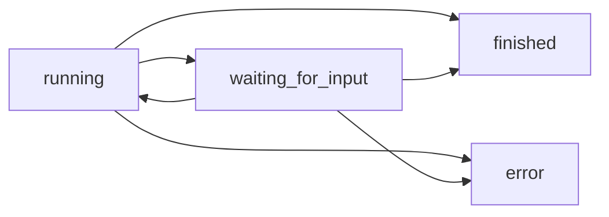

# Create Session

> Create a new agent session with a browser environment.

## Overview

Creates a new session with an agent and browser environment. The session is ready to receive messages and execute tasks.

## Request

<ParamField header="Authorization" type="string" required>
  Bearer token for authentication
</ParamField>

<ParamField body="agent_name" default="agi-0" type="string">
  The agent model to use for this session

  **Options:**

  * `agi-0` - Full-featured agent (default)
  * `agi-0-fast` - Faster agent for quick tasks
</ParamField>

<ParamField body="webhook_url" type="string">
  URL to receive webhook notifications for session lifecycle and task execution events

  * Must be a valid HTTP or HTTPS URL
  * Maximum length: 2,000 characters
  * Must start with `http://` or `https://`

  See [Webhooks documentation](/api-reference/webhooks) for details on webhook events and payloads.
</ParamField>

<ParamField body="restore_from_session_id" type="string">
  Restore session from a specific session's snapshot

  * Provide the UUID of a previously saved session
  * The new session will restore from that session's snapshot
  * Takes precedence over `restore_default_environment_from_user_id`

  See [Session Snapshots guide](/guides/session-snapshots) for details on saving and restoring snapshots.
</ParamField>

<ParamField body="restore_default_environment_from_user_id" type="string">
  Restore session from the user's default environment snapshot

  * Provide your user ID to restore from your default environment
  * Creates a session that automatically restores from the default snapshot
  * Lower priority than `restore_from_session_id`

  See [Session Snapshots guide](/guides/session-snapshots) for details on setting default environments.
</ParamField>

<ParamField body="enable_memory_snapshot" default="true" type="boolean">
  Enable memory snapshots for faster restoration

  * `true` - Uses memory snapshots for faster restoration (default, recommended)
  * `false` - Uses filesystem snapshots only (slower but more reliable)

  Only applies when restoring from a snapshot.
</ParamField>

## Response

<ResponseField name="session_id" type="string" required>
  Unique identifier (UUID) for the created session
</ResponseField>

<ResponseField name="vnc_url" type="string">
  URL to view and interact with the agent's browser in real-time
</ResponseField>

<ResponseField name="agent_name" type="string" required>
  The agent model being used
</ResponseField>

<ResponseField name="status" type="string" required>
  Current session status (typically `ready` for new sessions)
</ResponseField>

<ResponseField name="created_at" type="string" required>
  ISO 8601 timestamp of session creation
</ResponseField>

<ResponseExample>
  ```json Response theme={null}
  {
    "session_id": "f6a7b0e6-7f46-4a0d-9a47-92b7f0a4d2d3",
    "vnc_url": "https://vnc.agi.tech/session/f6a7b0e6...",
    "agent_name": "agi-0",
    "status": "ready",
    "created_at": "2025-10-05T18:04:34.281Z"
  }
  ```
</ResponseExample>

## Example Requests

<CodeGroup>
  ```bash cURL (Default) theme={null}
  curl -X POST https://api.agi.tech/v1/sessions \
    -H "Authorization: Bearer $AGI_API_KEY" \
    -H "Content-Type: application/json" \
    -d '{
      "agent_name": "agi-0"
    }'
  ```

  ```bash cURL (With Webhook) theme={null}
  curl -X POST https://api.agi.tech/v1/sessions \
    -H "Authorization: Bearer $AGI_API_KEY" \
    -H "Content-Type: application/json" \
    -d '{
      "agent_name": "agi-0",
      "webhook_url": "https://your-server.com/webhooks/sessions"
    }'
  ```

  ```python Python theme={null}
  import requests

  response = requests.post(
      "https://api.agi.tech/v1/sessions",
      headers={
          "Authorization": f"Bearer {API_KEY}",
          "Content-Type": "application/json"
      },
      json={
          "agent_name": "agi-0"
      }
  )

  session = response.json()
  print(f"Session created: {session['session_id']}")
  print(f"View browser at: {session['vnc_url']}")
  ```

  ```javascript JavaScript theme={null}
  const response = await fetch('https://api.agi.tech/v1/sessions', {
    method: 'POST',
    headers: {
      'Authorization': `Bearer ${API_KEY}`,
      'Content-Type': 'application/json'
    },
    body: JSON.stringify({
      agent_name: 'agi-0'
    })
  });

  const session = await response.json();
  console.log(`Session created: ${session.session_id}`);
  ```
</CodeGroup>

## Error Responses

<ResponseField name="422" type="error">
  Invalid agent name or request parameters
</ResponseField>

<ResponseField name="500" type="error">
  Infrastructure failure or bootstrap error
</ResponseField>

## Use Cases

### Quick Research Task

Create a session for one-time research without saving state:

```json  theme={null}
{
  "agent_name": "agi-0-fast"
}
```

### Watch Agent Work

Open the `vnc_url` in your browser to watch the agent navigate and interact with websites in real-time.

### With Webhooks

Create a session with webhook notifications for real-time event updates:

```json  theme={null}
{
  "agent_name": "agi-0",
  "webhook_url": "https://your-server.com/webhooks/sessions"
}
```

See [Webhooks documentation](/api-reference/webhooks) for complete webhook setup and event details.

### Restore from Default Snapshot

Create a session that automatically restores from your default environment:

```json  theme={null}
{
  "agent_name": "agi-0",
  "restore_default_environment_from_user_id": "your-user-id"
}
```

### Restore from Specific Session

Create a session restoring from a specific session's snapshot:

```json  theme={null}
{
  "agent_name": "agi-0",
  "restore_from_session_id": "550e8400-e29b-41d4-a716-446655440000"
}
```

See [Session Snapshots guide](/guides/session-snapshots) for complete details on saving and restoring snapshots.

## Best Practices

<Tip>
  Always store the returned `session_id` - you'll need it for all subsequent operations
</Tip>

<Warning>
  Sessions consume resources. Always delete sessions when done to avoid unnecessary charges
</Warning>

<Info>
  The `vnc_url` is perfect for debugging. Open it in a browser to see exactly what the agent is doing
</Info>

# List Sessions

> Get all sessions for the authenticated user.

## Overview

Returns a list of all sessions belonging to the authenticated user, including both active and completed sessions.

## Request

<ParamField header="Authorization" type="string" required>
  Bearer token for authentication
</ParamField>

## Response

Returns an array of session objects.

<ResponseField name="session_id" type="string">
  Unique identifier for the session
</ResponseField>

<ResponseField name="agent_name" type="string">
  The agent model being used
</ResponseField>

<ResponseField name="status" type="string">
  Current session status

  **Possible values:**

  * `initializing` - Session is being set up
  * `ready` - Ready to receive messages
  * `running` - Actively executing a task
  * `paused` - Execution is paused
  * `completed` - Task finished successfully
  * `error` - Session encountered an error
  * `terminated` - Session has been deleted
</ResponseField>

<ResponseField name="created_at" type="string">
  ISO 8601 timestamp of session creation
</ResponseField>

<ResponseExample>
  ```json Response theme={null}
  [
    {
      "session_id": "f6a7b0e6-7f46-4a0d-9a47-92b7f0a4d2d3",
      "agent_name": "agi-0",
      "status": "running",
      "created_at": "2025-10-05T18:04:34.281Z"
    },
    {
      "session_id": "a1b2c3d4-5e6f-7g8h-9i0j-k1l2m3n4o5p6",
      "agent_name": "agi-0-fast",
      "status": "completed",
      "created_at": "2025-10-05T17:30:15.123Z"
    }
  ]
  ```
</ResponseExample>

## Example Requests

<CodeGroup>
  ```bash cURL theme={null}
  curl https://api.agi.tech/v1/sessions \
    -H "Authorization: Bearer $AGI_API_KEY"
  ```

  ```python Python theme={null}
  import requests

  response = requests.get(
      "https://api.agi.tech/v1/sessions",
      headers={"Authorization": f"Bearer {API_KEY}"}
  )

  sessions = response.json()
  for session in sessions:
      print(f"Session {session['session_id']}: {session['status']}")
  ```

  ```javascript JavaScript theme={null}
  const response = await fetch('https://api.agi.tech/v1/sessions', {
    headers: {
      'Authorization': `Bearer ${API_KEY}`
    }
  });

  const sessions = await response.json();
  sessions.forEach(session => {
    console.log(`${session.session_id}: ${session.status}`);
  });
  ```
</CodeGroup>

## Use Cases

### Monitor Active Sessions

```python  theme={null}
# Get all running sessions
sessions = get_sessions()
active = [s for s in sessions if s['status'] == 'running']
print(f"Active sessions: {len(active)}")
```

### Clean Up Old Sessions

```python  theme={null}
# Delete completed sessions
sessions = get_sessions()
for session in sessions:
    if session['status'] in ['completed', 'error']:
        delete_session(session['session_id'])
```

### Session Dashboard

Build a dashboard showing all user sessions with their current status and creation time.

## Best Practices

<Tip>
  Poll this endpoint periodically to monitor session health and automatically clean up completed sessions
</Tip>

<Info>
  Use this endpoint to prevent duplicate session creation by checking for existing active sessions
</Info>

# Get Session

> .Get details for a specific session

## Overview

Retrieves detailed information about a specific session by its ID.

## Request

<ParamField path="session_id" type="string" required>
  The UUID of the session to retrieve
</ParamField>

<ParamField header="Authorization" type="string" required>
  Bearer token for authentication
</ParamField>

## Response

<ResponseField name="session_id" type="string" required>
  Unique identifier for the session
</ResponseField>

<ResponseField name="vnc_url" type="string">
  URL to view the agent's browser
</ResponseField>

<ResponseField name="agent_name" type="string" required>
  The agent model being used
</ResponseField>

<ResponseField name="status" type="string" required>
  Current session status
</ResponseField>

<ResponseField name="created_at" type="string" required>
  ISO 8601 timestamp of session creation
</ResponseField>

<ResponseExample>
  ```json Response theme={null}
  {
    "session_id": "f6a7b0e6-7f46-4a0d-9a47-92b7f0a4d2d3",
    "vnc_url": "https://vnc.agi.tech/session/f6a7b0e6...",
    "agent_name": "agi-0",
    "status": "running",
    "created_at": "2025-10-05T18:04:34.281Z"
  }
  ```
</ResponseExample>

## Example Requests

<CodeGroup>
  ```bash cURL theme={null}
  curl https://api.agi.tech/v1/sessions/f6a7b0e6-7f46-4a0d-9a47-92b7f0a4d2d3 \
    -H "Authorization: Bearer $AGI_API_KEY"
  ```

  ```python Python theme={null}
  import requests

  session_id = "f6a7b0e6-7f46-4a0d-9a47-92b7f0a4d2d3"

  response = requests.get(
      f"https://api.agi.tech/v1/sessions/{session_id}",
      headers={"Authorization": f"Bearer {API_KEY}"}
  )

  session = response.json()
  print(f"Status: {session['status']}")
  print(f"Agent: {session['agent_name']}")
  ```

  ```javascript JavaScript theme={null}
  const sessionId = 'f6a7b0e6-7f46-4a0d-9a47-92b7f0a4d2d3';

  const response = await fetch(
    `https://api.agi.tech/v1/sessions/${sessionId}`,
    {
      headers: {
        'Authorization': `Bearer ${API_KEY}`
      }
    }
  );

  const session = await response.json();
  console.log(`Status: ${session.status}`);
  ```
</CodeGroup>

## Error Responses

<ResponseField name="404" type="error">
  Session not found or not owned by authenticated user
</ResponseField>

## Use Cases

### Verify Session Exists

Check if a session is still available before sending messages:

```python  theme={null}
try:
    session = get_session(session_id)
    if session['status'] not in ['error', 'terminated']:
        send_message(session_id, "Continue task...")
except requests.HTTPError as e:
    if e.response.status_code == 404:
        print("Session no longer exists")
```

### Get VNC URL

Retrieve the VNC URL to share with team members for debugging:

```python  theme={null}
session = get_session(session_id)
vnc_url = session.get('vnc_url')
print(f"Watch the agent at: {vnc_url}")
```
# Delete Session

> Delete a specific session and clean up its resources.

## Overview

Clean up individual sessions when you're done using them. This frees up resources and prevents unnecessary charges.

## Request

<ParamField path="session_id" type="string" required>
  The UUID of the session to delete
</ParamField>

<ParamField header="Authorization" type="string" required>
  Bearer token for authentication
</ParamField>

<ParamField query="save_snapshot_mode" type="string">
  Snapshot mode when deleting the session

  **Options:**

  * `none` - No snapshot is saved (default)
  * `memory` - Creates a memory snapshot (fastest restoration, but may be less reliable)
  * `filesystem` - Creates a filesystem snapshot (more reliable, preserves all browser data including authentication)

  See [Session Snapshots guide](/guides/session-snapshots) for details on snapshot modes and authentication preservation.
</ParamField>

<ParamField query="save_as_default" type="boolean">
  Set the snapshot as the user's default environment

  * `true` - Save snapshot and set as default environment
  * `false` - Save snapshot without setting as default (default)

  When `true`, future sessions can automatically restore from this snapshot using `restore_default_environment_from_user_id`.

  Requires `save_snapshot_mode` to be set to `memory` or `filesystem`.
</ParamField>

## Response

<ResponseField name="success" type="boolean">
  Whether the operation completed successfully
</ResponseField>

<ResponseField name="deleted" type="boolean">
  Whether the session was actually deleted (`false` if not found)
</ResponseField>

<ResponseField name="message" type="string">
  Result message
</ResponseField>

<ResponseExample>
  ```json Success theme={null}
  {
    "success": true,
    "deleted": true,
    "message": "Session deleted successfully"
  }
  ```

  ```json Not Found theme={null}
  {
    "success": true,
    "deleted": false,
    "message": "Session not found"
  }
  ```
</ResponseExample>

## Example

<CodeGroup>
  ```bash cURL (Default) theme={null}
  curl -X DELETE https://api.agi.tech/v1/sessions/<session_id> \
    -H "Authorization: Bearer $AGI_API_KEY"
  ```

  ```bash cURL (Save Snapshot) theme={null}
  curl -X DELETE "https://api.agi.tech/v1/sessions/<session_id>?save_snapshot_mode=filesystem" \
    -H "Authorization: Bearer $AGI_API_KEY"
  ```

  ```bash cURL (Save as Default) theme={null}
  curl -X DELETE "https://api.agi.tech/v1/sessions/<session_id>?save_snapshot_mode=filesystem&save_as_default=true" \
    -H "Authorization: Bearer $AGI_API_KEY"
  ```

  ```python Python theme={null}
  def delete_session(session_id):
      response = requests.delete(
          f"https://api.agi.tech/v1/sessions/{session_id}",
          headers={"Authorization": f"Bearer {API_KEY}"}
      )
      result = response.json()
      return result["deleted"]

  # Usage
  if delete_session(session_id):
      print("Session deleted successfully")
  else:
      print("Session not found")
  ```

  ```javascript JavaScript theme={null}
  async function deleteSession(sessionId) {
    const response = await fetch(
      `https://api.agi.tech/v1/sessions/${sessionId}`,
      {
        method: 'DELETE',
        headers: {
          'Authorization': `Bearer ${API_KEY}`
        }
      }
    );

    const result = await response.json();
    return result.deleted;
  }
  ```
</CodeGroup>

## Use Cases

### Cleanup After Task

```python  theme={null}
# Standard pattern: always cleanup
session_id = create_session()

try:
    # Do work
    send_message(session_id, "Find product prices")
    results = wait_for_completion(session_id)
    process_results(results)
finally:
    # Always cleanup
    delete_session(session_id)
```

### Context Manager Pattern

```python  theme={null}
from contextlib import contextmanager

@contextmanager
def agent_session(agent_name="agi-0"):
    """Context manager for automatic cleanup"""
    session_id = create_session(agent_name)
    try:
        yield session_id
    finally:
        delete_session(session_id)

# Usage
with agent_session() as session_id:
    send_message(session_id, "Research AI companies")
    results = poll_until_complete(session_id)
# Session automatically deleted here
```

### Batch Cleanup

```python  theme={null}
# Clean up old completed sessions
def cleanup_completed_sessions():
    sessions = get_sessions()

    for session in sessions:
        if session["status"] in ["completed", "error"]:
            print(f"Deleting session {session['session_id']}")
            delete_session(session["session_id"])
```

### Selective Cleanup

```python  theme={null}
# Delete only sessions older than 1 hour
from datetime import datetime, timedelta

def cleanup_old_sessions(max_age_hours=1):
    sessions = get_sessions()
    now = datetime.now()

    for session in sessions:
        created_at = datetime.fromisoformat(
            session["created_at"].replace("Z", "+00:00")
        )

        age = now - created_at

        if age > timedelta(hours=max_age_hours):
            print(f"Deleting old session: {session['session_id']}")
            delete_session(session["session_id"])
```

### Resource Monitoring

```python  theme={null}
# Monitor and limit concurrent sessions
MAX_SESSIONS = 5

def create_managed_session():
    sessions = get_sessions()

    # Delete oldest if at limit
    if len(sessions) >= MAX_SESSIONS:
        oldest = min(sessions, key=lambda s: s["created_at"])
        print(f"At session limit, deleting oldest: {oldest['session_id']}")
        delete_session(oldest["session_id"])

    return create_session()
```

## Error Handling

```python  theme={null}
def safe_delete(session_id):
    """Delete with error handling"""
    try:
        result = delete_session(session_id)

        if result["deleted"]:
            print(f"Session {session_id} deleted")
        else:
            print(f"Session {session_id} not found (already deleted?)")

        return result["success"]

    except requests.HTTPError as e:
        if e.response.status_code == 404:
            print("Session doesn't exist")
            return True  # Already gone, that's fine
        else:
            print(f"Error deleting session: {e}")
            return False
```

## Deletion Behavior

| Scenario        | Result                             |
| --------------- | ---------------------------------- |
| Active session  | Immediately terminated and deleted |
| Running task    | Task cancelled, session deleted    |
| Paused session  | Session deleted                    |
| Completed task  | Session deleted                    |
| Non-existent ID | Returns `deleted: false`, no error |

<Note>
  Deletion is immediate and cannot be undone. Ensure you've retrieved any results before deleting.
</Note>

## Lifecycle Management

```python  theme={null}
class SessionManager:
    def __init__(self):
        self.active_sessions = []

    def create(self, agent_name="agi-0"):
        session_id = create_session(agent_name)
        self.active_sessions.append(session_id)
        return session_id

    def delete(self, session_id):
        if session_id in self.active_sessions:
            delete_session(session_id)
            self.active_sessions.remove(session_id)

    def cleanup_all(self):
        for session_id in self.active_sessions:
            try:
                delete_session(session_id)
            except Exception as e:
                print(f"Error deleting {session_id}: {e}")
        self.active_sessions.clear()

# Usage
manager = SessionManager()

# Register cleanup on exit
import atexit
atexit.register(manager.cleanup_all)

# Use manager
session = manager.create()
# ... do work ...
manager.delete(session)
```

## Saving Snapshots

### Save Snapshot on Deletion

To preserve session state (including authentication) for future use:

```python  theme={null}
# Save filesystem snapshot (recommended for authentication)
response = requests.delete(
    f"https://api.agi.tech/v1/sessions/{session_id}",
    headers={"Authorization": f"Bearer {API_KEY}"},
    params={"save_snapshot_mode": "filesystem"}
)
```

### Save and Set as Default

Save a snapshot and set it as your default environment:

```python  theme={null}
# Save snapshot and set as default
response = requests.delete(
    f"https://api.agi.tech/v1/sessions/{session_id}",
    headers={"Authorization": f"Bearer {API_KEY}"},
    params={
        "save_snapshot_mode": "filesystem",
        "save_as_default": "true"
    }
)
```

Future sessions can then automatically restore from this snapshot using `restore_default_environment_from_user_id`.

See [Session Snapshots guide](/guides/session-snapshots) for complete details on managing snapshots and authentication state.

## Best Practices

<Warning>
  Always delete sessions when done. Orphaned sessions consume resources and may incur charges.
</Warning>

<Tip>
  Use try/finally blocks or context managers to ensure cleanup even if errors occur.
</Tip>

<Tip>
  Save snapshots with `save_snapshot_mode=filesystem` after logging into services to preserve authentication state.
</Tip>

<Info>
  Deleting a session immediately terminates any running tasks and closes the browser.
</Info>

# Delete All Sessions

> Delete all sessions for the authenticated user.

## Overview

Clean up all sessions at once. Useful for emergency cleanup or application shutdown scenarios.

## Request

<ParamField header="Authorization" type="string" required>
  Bearer token for authentication
</ParamField>

## Response

<ResponseField name="success" type="boolean">
  Whether the operation completed successfully
</ResponseField>

<ResponseField name="deleted" type="boolean">
  Whether any sessions were deleted
</ResponseField>

<ResponseField name="message" type="string">
  Result message
</ResponseField>

<ResponseExample>
  ```json Response theme={null}
  {
    "success": true,
    "deleted": true,
    "message": "Sessions deleted successfully"
  }
  ```
</ResponseExample>

## Example

<CodeGroup>
  ```bash cURL theme={null}
  curl -X DELETE https://api.agi.tech/v1/sessions \
    -H "Authorization: Bearer $AGI_API_KEY"
  ```

  ```python Python theme={null}
  def delete_all_sessions():
      response = requests.delete(
          f"https://api.agi.tech/v1/sessions",
          headers={"Authorization": f"Bearer {API_KEY}"}
      )
      return response.json()

  # Usage
  result = delete_all_sessions()
  print(result["message"])
  ```

  ```javascript JavaScript theme={null}
  async function deleteAllSessions() {
    const response = await fetch(
      'https://api.agi.tech/v1/sessions',
      {
        method: 'DELETE',
        headers: {
          'Authorization': `Bearer ${API_KEY}`
        }
      }
    );

    return await response.json();
  }
  ```
</CodeGroup>

## Use Cases

### Emergency Cleanup

```python  theme={null}
# Delete all sessions on application shutdown
def shutdown_handler():
    print("Cleaning up all sessions...")
    result = delete_all_sessions()

    if result["deleted"]:
        print("All sessions cleaned up")
    else:
        print("No active sessions to clean")

# Register shutdown handler
import atexit
atexit.register(shutdown_handler)
```

## Best Practices

<Warning>
  This operation deletes ALL sessions immediately and cannot be undone. Use with caution.
</Warning>

<Tip>
  Consider using individual session deletion for more granular control in production environments.
</Tip>

<Info>
  All running tasks will be cancelled and browsers closed when sessions are deleted.
</Info>

# Send Message

> Send a message to the agent to start a task or respond to questions.

## Overview

Send a user message to the agent. Use this to:

* **Start a new task** - Give the agent initial instructions
* **Answer questions** - Respond when the agent asks for clarification
* **Provide updates** - Give the agent new information mid-task

## Request

<ParamField path="session_id" type="string" required>
  The UUID of the session
</ParamField>

<ParamField header="Authorization" type="string" required>
  Bearer token for authentication
</ParamField>

<ParamField body="message" type="string" required>
  The message text to send to the agent (1-10,000 characters)
</ParamField>

<ParamField body="start_url" type="string">
  Optional starting URL for the agent to navigate to (max 2,000 characters)
</ParamField>

## Response

<ResponseField name="success" type="boolean" required>
  Whether the message was successfully queued
</ResponseField>

<ResponseField name="message" type="string" required>
  Confirmation message
</ResponseField>

<ResponseExample>
  ```json Response theme={null}
  {
    "success": true,
    "message": "Message sent successfully"
  }
  ```
</ResponseExample>

## Example Requests

<CodeGroup>
  ```bash cURL (Basic) theme={null}
  curl -X POST https://api.agi.tech/v1/sessions/<session_id>/message \
    -H "Authorization: Bearer $AGI_API_KEY" \
    -H "Content-Type: application/json" \
    -d '{
      "message": "Find three nonstop SFO→JFK flights next month under $450"
    }'
  ```

  ```bash cURL (With Start URL) theme={null}
  curl -X POST https://api.agi.tech/v1/sessions/<session_id>/message \
    -H "Authorization: Bearer $AGI_API_KEY" \
    -H "Content-Type: application/json" \
    -d '{
      "message": "Compare prices for iPhone 15",
      "start_url": "https://www.apple.com"
    }'
  ```

  ```python Python theme={null}
  import requests

  def send_message(session_id, message, start_url=None):
      payload = {"message": message}
      if start_url:
          payload["start_url"] = start_url

      response = requests.post(
          f"https://api.agi.tech/v1/sessions/{session_id}/message",
          headers={
              "Authorization": f"Bearer {API_KEY}",
              "Content-Type": "application/json"
          },
          json=payload
      )
      return response.json()

  # Start a task
  result = send_message(
      session_id,
      "Research the top 3 AI companies and summarize their products"
  )

  # Answer a follow-up question
  result = send_message(
      session_id,
      "Yes, include startups founded after 2020"
  )
  ```

  ```javascript JavaScript theme={null}
  async function sendMessage(sessionId, message, startUrl = null) {
    const payload = { message };
    if (startUrl) payload.start_url = startUrl;

    const response = await fetch(
      `https://api.agi.tech/v1/sessions/${sessionId}/message`,
      {
        method: 'POST',
        headers: {
          'Authorization': `Bearer ${API_KEY}`,
          'Content-Type': 'application/json'
        },
        body: JSON.stringify(payload)
      }
    );

    return await response.json();
  }

  // Usage
  await sendMessage(sessionId, 'Find the best laptop deals under $1000');
  ```
</CodeGroup>

## Validation

<Warning>
  Messages are validated for:

  * Non-empty text
  * Length ≤ 10,000 characters
  * Valid UTF-8 encoding
</Warning>

## Use Cases

### E-commerce Research

```json  theme={null}
{
  "message": "Find the cheapest price for Sony WH-1000XM5 headphones on major retailers",
  "start_url": "https://www.google.com"
}
```

### Form Filling

```json  theme={null}
{
  "message": "Fill out this job application with my resume information",
  "start_url": "https://company.com/careers/apply"
}
```

### Data Extraction

```json  theme={null}
{
  "message": "Extract all product names and prices from this page into a structured format",
  "start_url": "https://example.com/products"
}
```

### Flight Booking

```json  theme={null}
{
  "message": "Book a round-trip flight from SFO to NYC, departing June 15, returning June 22, economy class, prefer morning flights"
}
```

### Responding to Questions

When the agent asks a question (message type `QUESTION`), respond naturally:

```json  theme={null}
{
  "message": "Yes, evening flights between 6-9 PM are preferred"
}
```

## Message Patterns

### Clear Task Definition

✅ **Good**: "Find 3 nonstop flights from SFO to JFK on June 15, budget \$400-500, prefer morning departures"

❌ **Bad**: "Find flights"

### Structured Requests

✅ **Good**: "Research iPhone 15 pricing at Best Buy, Amazon, and Apple Store. Return as JSON with store name and price"

❌ **Bad**: "Check iPhone prices"

### Actionable Instructions

✅ **Good**: "Navigate to LinkedIn, search for 'machine learning engineers in San Francisco', and save the first 10 profiles"

❌ **Bad**: "Find some ML engineers"

## Best Practices

<Tip>
  Be specific in your instructions. Include:

  * What you want the agent to do
  * Any constraints (budget, time, preferences)
  * Expected output format
</Tip>

<Info>
  The agent will ask questions if it needs clarification. Monitor messages and respond promptly.
</Info>

<Warning>
  Each session can only handle one task at a time. Wait for the current task to finish before starting a new one.
</Warning>

# Get Execution Status

> Get the current execution status of a session.

## Overview

Returns the current execution status of the agent. This is a lightweight endpoint perfect for polling to check if a task is complete.

<Info>
  This endpoint returns **execution status** (task state), not session status (lifecycle state). See the [Get Session](/api-reference/endpoints/get-session) endpoint for session status.
</Info>

## Request

<ParamField path="session_id" type="string" required>
  The UUID of the session
</ParamField>

<ParamField header="Authorization" type="string" required>
  Bearer token for authentication
</ParamField>

## Response

<ResponseField name="status" type="string" required>
  Current execution status

  **Possible values:**

  * `running` - Agent is actively executing a task
  * `waiting_for_input` - Agent is waiting for user response to a question
  * `finished` - Task completed successfully
  * `error` - Task encountered an error
</ResponseField>

<ResponseExample>
  ```json Response theme={null}
  {
    "status": "running"
  }
  ```
</ResponseExample>

## Example Requests

<CodeGroup>
  ```bash cURL theme={null}
  curl https://api.agi.tech/v1/sessions/<session_id>/status \
    -H "Authorization: Bearer $AGI_API_KEY"
  ```

  ```python Python theme={null}
  import requests
  import time

  def wait_for_completion(session_id, poll_interval=2):
      """Poll status until task completes"""
      while True:
          response = requests.get(
              f"https://api.agi.tech/v1/sessions/{session_id}/status",
              headers={"Authorization": f"Bearer {API_KEY}"}
          )

          status = response.json()["status"]
          print(f"Status: {status}")

          if status in ("finished", "error"):
              return status
          elif status == "waiting_for_input":
              print("Agent is waiting for your response")
              return status

          time.sleep(poll_interval)

  # Usage
  final_status = wait_for_completion(session_id)
  print(f"Task completed with status: {final_status}")
  ```

  ```javascript JavaScript theme={null}
  async function waitForCompletion(sessionId, pollInterval = 2000) {
    while (true) {
      const response = await fetch(
        `https://api.agi.tech/v1/sessions/${sessionId}/status`,
        {
          headers: {
            'Authorization': `Bearer ${API_KEY}`
          }
        }
      );

      const data = await response.json();
      console.log(`Status: ${data.status}`);

      if (['finished', 'error'].includes(data.status)) {
        return data.status;
      }

      if (data.status === 'waiting_for_input') {
        console.log('Agent needs your input');
        return data.status;
      }

      await new Promise(resolve => setTimeout(resolve, pollInterval));
    }
  }

  // Usage
  const status = await waitForCompletion(sessionId);
  ```
</CodeGroup>

## Status Flow



## Use Cases

### Simple Polling Loop

```python  theme={null}
# Check status every 2 seconds
while True:
    status = get_status(session_id)
    if status in ["finished", "error"]:
        break
    time.sleep(2)
```

### Conditional Logic

```python  theme={null}
status = get_status(session_id)

if status == "waiting_for_input":
    # Agent has a question - check messages
    messages = get_messages(session_id)
    # ... handle question
elif status == "finished":
    # Task complete - fetch final results
    messages = get_messages(session_id)
elif status == "error":
    # Handle error
    print("Task failed")
```

### Progress Updates

```python  theme={null}
def monitor_with_updates(session_id):
    start_time = time.time()

    while True:
        status = get_status(session_id)
        elapsed = int(time.time() - start_time)

        print(f"[{elapsed}s] Status: {status}")

        if status in ["finished", "error"]:
            break

        time.sleep(3)
```

## Status vs Session State

| Execution Status    | Meaning          | Session Status           |
| ------------------- | ---------------- | ------------------------ |
| `running`           | Task in progress | `running`                |
| `waiting_for_input` | Needs user input | `running`                |
| `finished`          | Task complete    | `running` or `completed` |
| `error`             | Task failed      | `error`                  |

<Note>
  A session can be `running` (lifecycle) while execution is `waiting_for_input` or `finished`. Use execution status to track task progress, not session status.
</Note>

## Best Practices

<Tip>
  Use this endpoint for simple status checks. It's more efficient than fetching full messages when you just need to know if the task is done.
</Tip>

<Info>
  Recommended polling interval: 1-3 seconds. More frequent polling is generally unnecessary.
</Info>

<Warning>
  Always handle the `waiting_for_input` status - the agent may need your response to continue.
</Warning>

# Get Messages

> Poll for messages and updates from the agent.

## Overview

Retrieve messages from the agent, including thoughts, questions, results, and errors. Use the `after_id` parameter to implement efficient polling.

## Request

<ParamField path="session_id" type="string" required>
  The UUID of the session
</ParamField>

<ParamField header="Authorization" type="string" required>
  Bearer token for authentication
</ParamField>

<ParamField query="after_id" default="0" type="integer">
  Return only messages with ID greater than this value. Use for incremental polling.
</ParamField>

<ParamField query="sanitize" default="true" type="boolean">
  Filter out system messages, internal prompts, and images. Set to `false` for debugging.
</ParamField>

## Response

<ResponseField name="messages" type="array" required>
  Array of message objects

  <Expandable title="Message Object">
    <ResponseField name="id" type="integer">
      Unique message ID (auto-incrementing)
    </ResponseField>

    <ResponseField name="type" type="string">
      Message type: `THOUGHT`, `QUESTION`, `USER`, `DONE`, `ERROR`, `LOG`
    </ResponseField>

    <ResponseField name="content" type="string | object">
      Message content (can be text or structured data)
    </ResponseField>

    <ResponseField name="timestamp" type="string">
      ISO 8601 timestamp
    </ResponseField>

    <ResponseField name="metadata" type="object">
      Additional context and metadata
    </ResponseField>
  </Expandable>
</ResponseField>

<ResponseField name="status" type="string" required>
  Current execution status: `running`, `waiting_for_input`, `finished`, `error`
</ResponseField>

<ResponseField name="has_agent" type="boolean" required>
  Whether the agent is connected and active
</ResponseField>

<ResponseExample>
  ```json Response theme={null}
  {
    "messages": [
      {
        "id": 17,
        "type": "QUESTION",
        "content": "Do you prefer evening flights?",
        "timestamp": "2025-10-05T18:05:01.555Z",
        "metadata": {"origin": "agent"}
      },
      {
        "id": 18,
        "type": "THOUGHT",
        "content": "Searching airline sites for available flights...",
        "timestamp": "2025-10-05T18:05:02.031Z",
        "metadata": {}
      },
      {
        "id": 19,
        "type": "DONE",
        "content": "Found 3 flights under $450: ...",
        "timestamp": "2025-10-05T18:05:45.123Z",
        "metadata": {"result_count": 3}
      }
    ],
    "status": "finished",
    "has_agent": true
  }
  ```
</ResponseExample>

## Example Requests

<CodeGroup>
  ```bash cURL (First Poll) theme={null}
  curl "https://api.agi.tech/v1/sessions/<session_id>/messages?after_id=0" \
    -H "Authorization: Bearer $AGI_API_KEY"
  ```

  ```bash cURL (Incremental) theme={null}
  # After receiving messages up to ID 25, get only newer messages
  curl "https://api.agi.tech/v1/sessions/<session_id>/messages?after_id=25" \
    -H "Authorization: Bearer $AGI_API_KEY"
  ```

  ```python Python theme={null}
  import requests
  import time

  def poll_messages(session_id, interval=2):
      """Poll for messages and print updates"""
      after_id = 0

      while True:
          response = requests.get(
              f"https://api.agi.tech/v1/sessions/{session_id}/messages",
              headers={"Authorization": f"Bearer {API_KEY}"},
              params={"after_id": after_id, "sanitize": True}
          )

          data = response.json()

          # Process new messages
          for msg in data["messages"]:
              after_id = max(after_id, msg["id"])
              print(f"[{msg['type']}] {msg['content']}")

              # Handle questions
              if msg["type"] == "QUESTION":
                  answer = input("Your answer: ")
                  send_message(session_id, answer)

          # Check if done
          if data["status"] in ("finished", "error"):
              break

          time.sleep(interval)

      return after_id

  # Usage
  poll_messages(session_id)
  ```

  ```javascript JavaScript theme={null}
  async function pollMessages(sessionId, interval = 2000) {
    let afterId = 0;

    while (true) {
      const response = await fetch(
        `https://api.agi.tech/v1/sessions/${sessionId}/messages?after_id=${afterId}`,
        {
          headers: {
            'Authorization': `Bearer ${API_KEY}`
          }
        }
      );

      const data = await response.json();

      // Process new messages
      for (const msg of data.messages) {
        afterId = Math.max(afterId, msg.id);
        console.log(`[${msg.type}] ${msg.content}`);

        // Handle questions
        if (msg.type === 'QUESTION') {
          // Prompt user for answer and send response
        }
      }

      // Check if complete
      if (['finished', 'error'].includes(data.status)) {
        break;
      }

      await new Promise(resolve => setTimeout(resolve, interval));
    }
  }
  ```
</CodeGroup>

## Message Types

### THOUGHT

Agent's reasoning or actions being taken

```json  theme={null}
{
  "type": "THOUGHT",
  "content": "Navigating to Kayak.com to search for flights..."
}
```

### QUESTION

Agent needs user input to continue

```json  theme={null}
{
  "type": "QUESTION",
  "content": "Would you like me to filter for direct flights only?"
}
```

### DONE

Task completion with results

```json  theme={null}
{
  "type": "DONE",
  "content": {
    "summary": "Found 3 flights",
    "flights": [...]
  }
}
```

### ERROR

Error occurred during execution

```json  theme={null}
{
  "type": "ERROR",
  "content": "Unable to access website - connection timeout"
}
```

### LOG

Additional context or debugging info

```json  theme={null}
{
  "type": "LOG",
  "content": "Page loaded successfully: https://kayak.com"
}
```

## Use Cases

### Incremental Polling

```python  theme={null}
# Efficient polling - only fetch new messages
after_id = 0
while True:
    data = get_messages(session_id, after_id)

    for msg in data["messages"]:
        after_id = max(after_id, msg["id"])
        process_message(msg)

    if data["status"] == "finished":
        break
```

### Interactive Q\&A

```python  theme={null}
def handle_messages(session_id):
    after_id = 0

    while True:
        data = get_messages(session_id, after_id)

        for msg in data["messages"]:
            after_id = max(after_id, msg["id"])

            if msg["type"] == "QUESTION":
                print(f"Agent asks: {msg['content']}")
                answer = input("Your answer: ")
                send_message(session_id, answer)
            elif msg["type"] == "THOUGHT":
                print(f"Agent: {msg['content']}")

        if data["status"] in ["finished", "error"]:
            break
```

### Extract Final Results

```python  theme={null}
# Get all messages after task completes
data = get_messages(session_id, after_id=0, sanitize=True)

# Find the DONE message with results
for msg in data["messages"]:
    if msg["type"] == "DONE":
        results = msg["content"]
        print(f"Results: {results}")
```

## Polling Pattern

```python  theme={null}
# Recommended pattern
after_id = 0

while True:
    # Fetch new messages
    data = get_messages(session_id, after_id)

    # Process each message
    for msg in data["messages"]:
        # Update tracking
        after_id = max(after_id, msg["id"])

        # Handle message
        handle_message(msg)

    # Check completion
    if data["status"] in ["finished", "error"]:
        break

    # Wait before next poll
    time.sleep(2)
```

<Note>
  For real-time updates without polling, consider using [Server-Sent Events](/api-reference/endpoints/stream-events) instead.
</Note>

## Best Practices

<Tip>
  Always track the highest `id` you've seen and use it as `after_id` in the next poll. This prevents fetching duplicate messages.
</Tip>

<Info>
  Poll interval recommendation: 1-3 seconds. Balance between responsiveness and API load.
</Info>

<Warning>
  The `sanitize` parameter is `true` by default. Set to `false` only when debugging to see internal system messages.
</Warning>

# Stream Events (SSE)

> Real-time event stream using Server-Sent Events.

## Overview

Connect to a real-time event stream to receive updates as they happen. This uses Server-Sent Events (SSE) for push-based updates instead of polling.

<Info>
  SSE provides lower latency than polling and is more efficient for monitoring long-running tasks.
</Info>

## Request

<ParamField path="session_id" type="string" required>
  The UUID of the session
</ParamField>

<ParamField header="Authorization" type="string" required>
  Bearer token for authentication
</ParamField>

<ParamField header="Accept" type="string" required>
  Must be set to `text/event-stream`
</ParamField>

<ParamField query="sanitize" default="true" type="boolean">
  Filter out system messages, internal prompts, and images
</ParamField>

<ParamField query="event_types" type="string">
  Comma-separated list of event types to subscribe to

  **Available types:**

  * `step` - Agent actions and navigation
  * `thought` - Agent reasoning
  * `question` - Questions requiring user input
  * `done` - Task completion
  * `error` - Errors
  * `log` - Debug logs
  * `paused` - Session paused
  * `resumed` - Session resumed
  * `heartbeat` - Keep-alive signals
</ParamField>

<ParamField query="include_history" default="true" type="boolean">
  Send historical messages immediately upon connection
</ParamField>

## Response Format

SSE events follow this format:

```
id: 42
event: thought
data: {"text":"Searching for flights...","message_id":42}

id: 43
event: question
data: {"text":"Prefer morning or evening?","message_id":43}

event: heartbeat
data: {"timestamp":"2025-10-05T18:05:30Z"}
```

### Event Fields

<ResponseField name="id" type="string">
  Message ID for tracking
</ResponseField>

<ResponseField name="event" type="string">
  Event type (thought, question, done, error, etc.)
</ResponseField>

<ResponseField name="data" type="json">
  Event payload as JSON string
</ResponseField>

## Example Requests

<CodeGroup>
  ```bash cURL theme={null}
  curl -N https://api.agi.tech/v1/sessions/<session_id>/events \
    -H "Authorization: Bearer $AGI_API_KEY" \
    -H "Accept: text/event-stream"
  ```

  ```bash cURL (Filtered) theme={null}
  # Only receive thoughts and questions
  curl -N https://api.agi.tech/v1/sessions/<session_id>/events?event_types=thought,question \
    -H "Authorization: Bearer $AGI_API_KEY" \
    -H "Accept: text/event-stream"
  ```

  ```python Python theme={null}
  import requests
  import json

  def stream_events(session_id):
      """Stream events using SSE"""
      url = f"https://api.agi.tech/v1/sessions/{session_id}/events"
      headers = {
          "Authorization": f"Bearer {API_KEY}",
          "Accept": "text/event-stream"
      }

      with requests.get(url, headers=headers, stream=True) as response:
          response.raise_for_status()

          for line in response.iter_lines():
              if not line:
                  continue

              line = line.decode('utf-8')

              # Parse SSE format
              if line.startswith('data: '):
                  data = json.loads(line[6:])
                  print(f"Event: {data}")

              elif line.startswith('event: '):
                  event_type = line[7:]
                  print(f"Type: {event_type}")

  # Usage
  stream_events(session_id)
  ```

  ```python Python (sseclient) theme={null}
  # Using sseclient library for cleaner code
  from sseclient import SSEClient
  import json

  def stream_events_simple(session_id):
      url = f"https://api.agi.tech/v1/sessions/{session_id}/events"
      headers = {"Authorization": f"Bearer {API_KEY}"}

      messages = SSEClient(url, headers=headers)

      for msg in messages:
          if msg.data:
              data = json.loads(msg.data)

              if msg.event == 'thought':
                  print(f"Agent thinking: {data['text']}")

              elif msg.event == 'question':
                  print(f"Question: {data['text']}")
                  # Send answer
                  answer = input("Your answer: ")
                  send_message(session_id, answer)

              elif msg.event == 'done':
                  print(f"Completed: {data}")
                  break

              elif msg.event == 'error':
                  print(f"Error: {data}")
                  break

  # Usage
  stream_events_simple(session_id)
  ```

  ```javascript JavaScript theme={null}
  async function streamEvents(sessionId) {
    const response = await fetch(
      `https://api.agi.tech/v1/sessions/${sessionId}/events`,
      {
        headers: {
          'Authorization': `Bearer ${API_KEY}`,
          'Accept': 'text/event-stream'
        }
      }
    );

    const reader = response.body.getReader();
    const decoder = new TextDecoder();

    while (true) {
      const { value, done } = await reader.read();
      if (done) break;

      const chunk = decoder.decode(value);
      const lines = chunk.split('\n');

      for (const line of lines) {
        if (line.startsWith('data: ')) {
          const data = JSON.parse(line.slice(6));
          console.log('Event:', data);
        }
      }
    }
  }

  // Usage
  streamEvents(sessionId);
  ```

  ```javascript JavaScript (EventSource) theme={null}
  // Using EventSource API (browser)
  function streamEventsWithEventSource(sessionId) {
    const url = `https://api.agi.tech/v1/sessions/${sessionId}/events`;

    const eventSource = new EventSource(url, {
      headers: {
        'Authorization': `Bearer ${API_KEY}`
      }
    });

    eventSource.addEventListener('thought', (e) => {
      const data = JSON.parse(e.data);
      console.log('Thought:', data.text);
    });

    eventSource.addEventListener('question', (e) => {
      const data = JSON.parse(e.data);
      console.log('Question:', data.text);
      // Handle question
    });

    eventSource.addEventListener('done', (e) => {
      const data = JSON.parse(e.data);
      console.log('Done:', data);
      eventSource.close();
    });

    eventSource.addEventListener('error', (e) => {
      console.error('Stream error:', e);
      eventSource.close();
    });
  }
  ```
</CodeGroup>

## Event Types

### thought

Agent's reasoning or actions

```json  theme={null}
{
  "event": "thought",
  "data": {
    "text": "Navigating to Kayak to search for flights...",
    "message_id": 42
  }
}
```

### question

Agent needs user input

```json  theme={null}
{
  "event": "question",
  "data": {
    "text": "Would you like direct flights only?",
    "message_id": 43
  }
}
```

### done

Task completed successfully

```json  theme={null}
{
  "event": "done",
  "data": {
    "text": "Task completed",
    "result": {...},
    "message_id": 50
  }
}
```

### error

Error occurred

```json  theme={null}
{
  "event": "error",
  "data": {
    "error": "Connection timeout",
    "status_code": 500
  }
}
```

### heartbeat

Keep-alive signal (sent every \~30 seconds)

```json  theme={null}
{
  "event": "heartbeat",
  "data": {
    "timestamp": "2025-10-05T18:05:30Z"
  }
}
```

## Use Cases

### Real-time Monitoring Dashboard

```python  theme={null}
def monitor_dashboard(session_id):
    """Display real-time updates in a dashboard"""
    for event in stream_events(session_id):
        if event['type'] == 'thought':
            update_status_display(event['data']['text'])
        elif event['type'] == 'question':
            show_question_prompt(event['data']['text'])
        elif event['type'] == 'done':
            show_completion(event['data'])
            break
```

### Filtered Event Stream

```python  theme={null}
# Only monitor critical events
url = f"{BASE_URL}/sessions/{session_id}/events"
params = {
    "event_types": "question,done,error",
    "sanitize": True
}

# Stream will only send questions, completion, and errors
```

### Auto-reconnect on Disconnect

```python  theme={null}
def stream_with_reconnect(session_id, max_retries=3):
    retries = 0

    while retries < max_retries:
        try:
            stream_events(session_id)
            break  # Completed successfully
        except Exception as e:
            retries += 1
            print(f"Connection lost, retry {retries}/{max_retries}")
            time.sleep(2)
```

## SSE vs Polling

| Feature    | SSE                  | Polling              |
| ---------- | -------------------- | -------------------- |
| Latency    | Low (\~instant)      | Medium (1-3s)        |
| Efficiency | High                 | Lower                |
| Complexity | Medium               | Simple               |
| Use Case   | Real-time monitoring | Simple status checks |

**Use SSE when:**

* You need immediate updates
* Monitoring long-running tasks
* Building interactive UIs

**Use Polling when:**

* Simple status checks
* Client doesn't support SSE
* Stateless serverless functions

## Connection Management

```python  theme={null}
# Recommended pattern with timeout
import signal

def stream_with_timeout(session_id, timeout=300):
    """Stream with maximum duration"""

    def timeout_handler(signum, frame):
        raise TimeoutError("Stream timeout")

    signal.signal(signal.SIGALRM, timeout_handler)
    signal.alarm(timeout)

    try:
        stream_events(session_id)
    except TimeoutError:
        print("Stream exceeded timeout")
    finally:
        signal.alarm(0)  # Cancel alarm
```

## Best Practices

<Tip>
  Use SSE for real-time monitoring and long-running tasks. It's more efficient than polling for immediate updates.
</Tip>

<Info>
  The connection will automatically close when the task completes (`done` or `error` event).
</Info>

<Warning>
  SSE connections can drop due to network issues. Implement reconnection logic with exponential backoff.
</Warning>

<Note>
  Set `include_history: false` if you only want new events, not historical messages from before connection.
</Note>

# Pause Session

> Temporarily pause task execution.

## Overview

Pause a running task temporarily. The session remains active and can be resumed later. Useful for rate limiting, user verification, or temporary interruptions.

## Request

<ParamField path="session_id" type="string" required>
  The UUID of the session
</ParamField>

<ParamField header="Authorization" type="string" required>
  Bearer token for authentication
</ParamField>

## Response

<ResponseField name="success" type="boolean">
  Whether the operation completed successfully
</ResponseField>

<ResponseField name="message" type="string">
  Result message
</ResponseField>

<ResponseExample>
  ```json Response theme={null}
  {
    "success": true,
    "message": "Session paused successfully"
  }
  ```
</ResponseExample>

## Example

<CodeGroup>
  ```bash cURL theme={null}
  curl -X POST https://api.agi.tech/v1/sessions/<session_id>/pause \
    -H "Authorization: Bearer $AGI_API_KEY"
  ```

  ```python Python theme={null}
  def pause_session(session_id):
      response = requests.post(
          f"https://api.agi.tech/v1/sessions/{session_id}/pause",
          headers={"Authorization": f"Bearer {API_KEY}"}
      )
      return response.json()

  # Usage
  result = pause_session(session_id)
  if result["success"]:
      print("Session paused")
  ```
</CodeGroup>

## Use Cases

### Rate Limiting

```python  theme={null}
# Pause during rate limit, resume after cooldown
def handle_rate_limit(session_id, cooldown=60):
    pause_session(session_id)
    print(f"Pausing for {cooldown}s due to rate limit")
    time.sleep(cooldown)
    resume_session(session_id)
```

### User Verification

```python  theme={null}
# Pause for user approval before proceeding
pause_session(session_id)
print("Agent wants to make a purchase. Approve? (y/n)")
approval = input()

if approval.lower() == 'y':
    resume_session(session_id)
else:
    cancel_session(session_id)
```

### Temporary Interruption

```python  theme={null}
# Pause to adjust task parameters
pause_session(session_id)

# Send updated instructions
send_message(session_id, "Also check Amazon for comparison")

# Resume with new context
resume_session(session_id)
```

## Error Handling

```python  theme={null}
def safe_pause(session_id):
    """Pause with error handling"""
    try:
        result = pause_session(session_id)
        return result["success"]
    except requests.HTTPError as e:
        if e.response.status_code == 404:
            print("Session not found")
        elif "already_paused" in str(e.response.text):
            print("Session already paused")
        else:
            raise
        return False
```

## Best Practices

<Warning>
  Pausing doesn't preserve browser state permanently. For long pauses, consider deleting and recreating the session.
</Warning>

<Tip>
  Use pause/resume for temporary interruptions. Use cancel if you want to abandon the current task entirely.
</Tip>

<Info>
  A paused session can be resumed with the resume endpoint or cancelled with the cancel endpoint.
</Info>

# Resume Session

> Resume a paused task.

## Overview

Resume execution of a paused task. The task continues from where it was paused.

## Request

<ParamField path="session_id" type="string" required>
  The UUID of the session
</ParamField>

<ParamField header="Authorization" type="string" required>
  Bearer token for authentication
</ParamField>

## Response

<ResponseField name="success" type="boolean">
  Whether the operation completed successfully
</ResponseField>

<ResponseField name="message" type="string">
  Result message
</ResponseField>

<ResponseExample>
  ```json Response theme={null}
  {
    "success": true,
    "message": "Session resumed successfully"
  }
  ```
</ResponseExample>

## Example

<CodeGroup>
  ```bash cURL theme={null}
  curl -X POST https://api.agi.tech/v1/sessions/<session_id>/resume \
    -H "Authorization: Bearer $AGI_API_KEY"
  ```

  ```python Python theme={null}
  def resume_session(session_id):
      response = requests.post(
          f"https://api.agi.tech/v1/sessions/{session_id}/resume",
          headers={"Authorization": f"Bearer {API_KEY}"}
      )
      return response.json()

  # Usage
  result = resume_session(session_id)
  if result["success"]:
      print("Session resumed")
  ```
</CodeGroup>

## Use Cases

### After Rate Limit Cooldown

```python  theme={null}
# Pause during rate limit, resume after cooldown
def handle_rate_limit(session_id, cooldown=60):
    pause_session(session_id)
    print(f"Pausing for {cooldown}s due to rate limit")
    time.sleep(cooldown)
    resume_session(session_id)
```

### After User Approval

```python  theme={null}
# Pause for user approval, resume if approved
pause_session(session_id)
print("Agent wants to make a purchase. Approve? (y/n)")
approval = input()

if approval.lower() == 'y':
    resume_session(session_id)
else:
    cancel_session(session_id)
```

### After Parameter Update

```python  theme={null}
# Pause to adjust task parameters
pause_session(session_id)

# Send updated instructions
send_message(session_id, "Also check Amazon for comparison")

# Resume with new context
resume_session(session_id)
```

## Error Handling

```python  theme={null}
def safe_resume(session_id):
    """Resume with error handling"""
    try:
        result = resume_session(session_id)
        return result["success"]
    except requests.HTTPError as e:
        if e.response.status_code == 404:
            print("Session not found")
        elif "not_paused" in str(e.response.text):
            print("Session is not paused")
        else:
            raise
        return False
```

## Best Practices

<Tip>
  Resume only works on paused sessions. Check session status before attempting to resume.
</Tip>

<Info>
  Resuming a session continues task execution from where it was paused. The agent maintains its context.
</Info>

# Cancel Session

> Cancel the current task execution.

## Overview

Cancel the current task execution. The session remains active and can receive new messages to start a different task. Use this when you want to abandon the current task but keep the session.

## Request

<ParamField path="session_id" type="string" required>
  The UUID of the session
</ParamField>

<ParamField header="Authorization" type="string" required>
  Bearer token for authentication
</ParamField>

## Response

<ResponseField name="success" type="boolean">
  Whether the operation completed successfully
</ResponseField>

<ResponseField name="message" type="string">
  Result message
</ResponseField>

<ResponseExample>
  ```json Response theme={null}
  {
    "success": true,
    "message": "Session cancelled successfully"
  }
  ```
</ResponseExample>

## Example

<CodeGroup>
  ```bash cURL theme={null}
  curl -X POST https://api.agi.tech/v1/sessions/<session_id>/cancel \
    -H "Authorization: Bearer $AGI_API_KEY"
  ```

  ```python Python theme={null}
  def cancel_session(session_id):
      response = requests.post(
          f"https://api.agi.tech/v1/sessions/{session_id}/cancel",
          headers={"Authorization": f"Bearer {API_KEY}"}
      )
      return response.json()

  # Usage
  result = cancel_session(session_id)
  if result["success"]:
      print("Task cancelled")
  ```
</CodeGroup>

## Use Cases

### Emergency Stop

```python  theme={null}
# User clicks "stop" button
def emergency_stop(session_id):
    try:
        result = cancel_session(session_id)
        print("Task cancelled")
    except Exception as e:
        # Fallback: delete entire session
        delete_session(session_id)
```

### User Rejection

```python  theme={null}
# Pause for user approval, cancel if rejected
pause_session(session_id)
print("Agent wants to make a purchase. Approve? (y/n)")
approval = input()

if approval.lower() == 'y':
    resume_session(session_id)
else:
    cancel_session(session_id)
```

### Task Abandonment

```python  theme={null}
# Cancel current task and start a new one
cancel_session(session_id)

# Send new task
send_message(session_id, "Find flights to Paris instead")
```

## Cancel vs Delete

| Operation  | Effect                          | Use When                     |
| ---------- | ------------------------------- | ---------------------------- |
| **Cancel** | Stop task, session stays active | Want to abandon current task |
| **Delete** | Destroy entire session          | Completely done with session |

## Best Practices

<Tip>
  Use cancel when you want to stop the current task but keep the session active for a new task.
</Tip>

<Info>
  After cancelling, the session remains active. Send a new message to start a different task, or delete the session to clean up.
</Info>

<Note>
  Cancelled sessions can still receive new messages to start fresh tasks. Deleted sessions are permanently removed.
</Note>

# Navigate Browser

> Navigate the browser to a specific URL.

## Overview

Navigate the browser to a specific URL. This provides direct control over browser navigation, independent of agent tasks.

## Request

<ParamField path="session_id" type="string" required>
  The UUID of the session
</ParamField>

<ParamField header="Authorization" type="string" required>
  Bearer token for authentication
</ParamField>

<ParamField body="url" type="string" required>
  Absolute URL to navigate to (must start with `http://` or `https://`)

  Maximum length: 2,000 characters
</ParamField>

## Response

<ResponseField name="current_url" type="string">
  The URL after navigation (may differ if redirected)
</ResponseField>

<ResponseExample>
  ```json Response theme={null}
  {
    "current_url": "https://www.kayak.com/flights"
  }
  ```
</ResponseExample>

## Example

<CodeGroup>
  ```bash cURL theme={null}
  curl -X POST https://api.agi.tech/v1/sessions/<session_id>/navigate \
    -H "Authorization: Bearer $AGI_API_KEY" \
    -H "Content-Type: application/json" \
    -d '{
      "url": "https://www.kayak.com/flights"
    }'
  ```

  ```python Python theme={null}
  def navigate_to(session_id, url):
      response = requests.post(
          f"https://api.agi.tech/v1/sessions/{session_id}/navigate",
          headers={
              "Authorization": f"Bearer {API_KEY}",
              "Content-Type": "application/json"
          },
          json={"url": url}
      )
      return response.json()["current_url"]

  # Usage
  current_url = navigate_to(session_id, "https://amazon.com")
  print(f"Navigated to: {current_url}")
  ```

  ```javascript JavaScript theme={null}
  async function navigateTo(sessionId, url) {
    const response = await fetch(
      `https://api.agi.tech/v1/sessions/${sessionId}/navigate`,
      {
        method: 'POST',
        headers: {
          'Authorization': `Bearer ${API_KEY}`,
          'Content-Type': 'application/json'
        },
        body: JSON.stringify({ url })
      }
    );

    const data = await response.json();
    return data.current_url;
  }
  ```
</CodeGroup>

## Validation

<Warning>
  URL must start with `http://` or `https://`. Relative URLs and other protocols are not supported.
</Warning>

## Use Cases

### Pre-Navigation Setup

```python  theme={null}
# Navigate to login page before starting agent task
navigate_to(session_id, "https://example.com/login")
time.sleep(2)  # Let page load

# Now send agent task
send_message(session_id, "Fill out the form with my saved credentials")
```

### Verify Navigation

```python  theme={null}
# Navigate and verify successful load
target_url = "https://amazon.com"
current_url = navigate_to(session_id, target_url)

if "amazon.com" in current_url:
    print("Successfully navigated to Amazon")
else:
    print(f"Unexpected redirect to: {current_url}")
```

### Multi-URL Task

```python  theme={null}
# Navigate through multiple sites
urls = [
    "https://amazon.com",
    "https://bestbuy.com",
    "https://walmart.com"
]

prices = []

for url in urls:
    navigate_to(session_id, url)
    send_message(session_id, "Find iPhone 15 Pro price")

    # Wait for result
    result = wait_for_completion(session_id)
    prices.append(result)
```

## Error Handling

```python  theme={null}
def safe_navigate(session_id, url):
    """Navigate with validation"""
    # Validate URL format
    if not url.startswith(('http://', 'https://')):
        raise ValueError("URL must start with http:// or https://")

    if len(url) > 2000:
        raise ValueError("URL too long (max 2000 chars)")

    try:
        current_url = navigate_to(session_id, url)
        return current_url
    except requests.HTTPError as e:
        if e.response.status_code == 400:
            print("Invalid URL format")
        elif e.response.status_code == 404:
            print("Session not found")
        raise
```

## Navigate vs Message with URL

| Method                       | When to Use                           |
| ---------------------------- | ------------------------------------- |
| **Navigate API**             | Direct control, immediate navigation  |
| **Message with start\_url**  | Let agent handle navigation naturally |
| **Message with URL in text** | Agent decides how to interpret URL    |

## Best Practices

<Tip>
  Use navigate before sending a message to ensure the agent starts on the right page.
</Tip>

<Warning>
  The `navigate` endpoint changes browser state immediately. Use carefully to avoid disrupting agent tasks.
</Warning>

<Note>
  For most use cases, providing a `start_url` in your message is more flexible than using the navigate endpoint directly.
</Note>

# Get Screenshot

> Capture a screenshot of the current browser state.

## Overview

Capture a screenshot of the current browser state. Useful for debugging, monitoring progress, or verifying page state after operations.

## Request

<ParamField path="session_id" type="string" required>
  The UUID of the session
</ParamField>

<ParamField header="Authorization" type="string" required>
  Bearer token for authentication
</ParamField>

## Response

<ResponseField name="screenshot" type="string">
  Base64-encoded JPEG image as a data URL

  Format: `data:image/jpeg;base64,/9j/4AAQSkZJRg...`
</ResponseField>

<ResponseField name="url" type="string">
  Current page URL
</ResponseField>

<ResponseField name="title" type="string">
  Current page title
</ResponseField>

<ResponseExample>
  ```json Response theme={null}
  {
    "screenshot": "data:image/jpeg;base64,/9j/4AAQSkZJRgABAQ...",
    "url": "https://www.kayak.com/flights",
    "title": "KAYAK: Flights"
  }
  ```
</ResponseExample>

## Example

<CodeGroup>
  ```bash cURL theme={null}
  curl https://api.agi.tech/v1/sessions/<session_id>/screenshot \
    -H "Authorization: Bearer $AGI_API_KEY"
  ```

  ```python Python theme={null}
  import base64
  from PIL import Image
  from io import BytesIO

  def get_screenshot(session_id, save_path=None):
      response = requests.get(
          f"https://api.agi.tech/v1/sessions/{session_id}/screenshot",
          headers={"Authorization": f"Bearer {API_KEY}"}
      )

      data = response.json()

      # Extract base64 image data
      img_data = data["screenshot"].split(",")[1]
      img_bytes = base64.b64decode(img_data)

      # Optionally save to file
      if save_path:
          with open(save_path, "wb") as f:
              f.write(img_bytes)

      # Return as PIL Image for processing
      return Image.open(BytesIO(img_bytes)), data

  # Usage
  img, metadata = get_screenshot(session_id, "screenshot.jpg")
  print(f"Screenshot of: {metadata['title']}")
  print(f"Current URL: {metadata['url']}")
  print(f"Image size: {img.size}")
  ```

  ```python Python (Display in Notebook) theme={null}
  # Jupyter notebook display
  from IPython.display import Image, display

  def show_screenshot(session_id):
      response = requests.get(
          f"https://api.agi.tech/v1/sessions/{session_id}/screenshot",
          headers={"Authorization": f"Bearer {API_KEY}"}
      )

      data = response.json()
      img_data = data["screenshot"].split(",")[1]

      display(Image(data=base64.b64decode(img_data)))
      print(f"URL: {data['url']}")
      print(f"Title: {data['title']}")

  show_screenshot(session_id)
  ```

  ```javascript JavaScript theme={null}
  async function getScreenshot(sessionId) {
    const response = await fetch(
      `https://api.agi.tech/v1/sessions/${sessionId}/screenshot`,
      {
        headers: {
          'Authorization': `Bearer ${API_KEY}`
        }
      }
    );

    const data = await response.json();

    // Display in browser (if in DOM context)
    const img = document.createElement('img');
    img.src = data.screenshot;
    document.body.appendChild(img);

    return data;
  }
  ```
</CodeGroup>

## Use Cases

### Visual Debugging

```python  theme={null}
# Take screenshot at key points
send_message(session_id, "Add item to cart")
time.sleep(5)

screenshot, info = get_screenshot(session_id)
screenshot.save("after_add_to_cart.jpg")
print(f"Currently on: {info['title']}")
```

### Progress Monitoring

```python  theme={null}
# Capture screenshots during long task
def monitor_with_screenshots(session_id, interval=10):
    start_time = time.time()
    screenshot_count = 0

    while True:
        status = get_status(session_id)

        if status in ["finished", "error"]:
            break

        # Capture periodic screenshots
        if int(time.time() - start_time) % interval == 0:
            screenshot_count += 1
            get_screenshot(session_id, f"progress_{screenshot_count}.jpg")

        time.sleep(1)
```

### Screenshot Verification

```python  theme={null}
# Verify successful form submission
send_message(session_id, "Submit the contact form")
time.sleep(3)

screenshot, info = get_screenshot(session_id)

# Check if on success page
if "success" in info['url'].lower() or "thank" in info['title'].lower():
    print("Form submitted successfully")
else:
    print("Submission may have failed")
```

## Best Practices

<Info>
  Screenshots are useful for debugging and verification, but avoid excessive calls as they can be resource-intensive.
</Info>

<Tip>
  Use screenshots strategically at key decision points rather than continuously polling.
</Tip>
